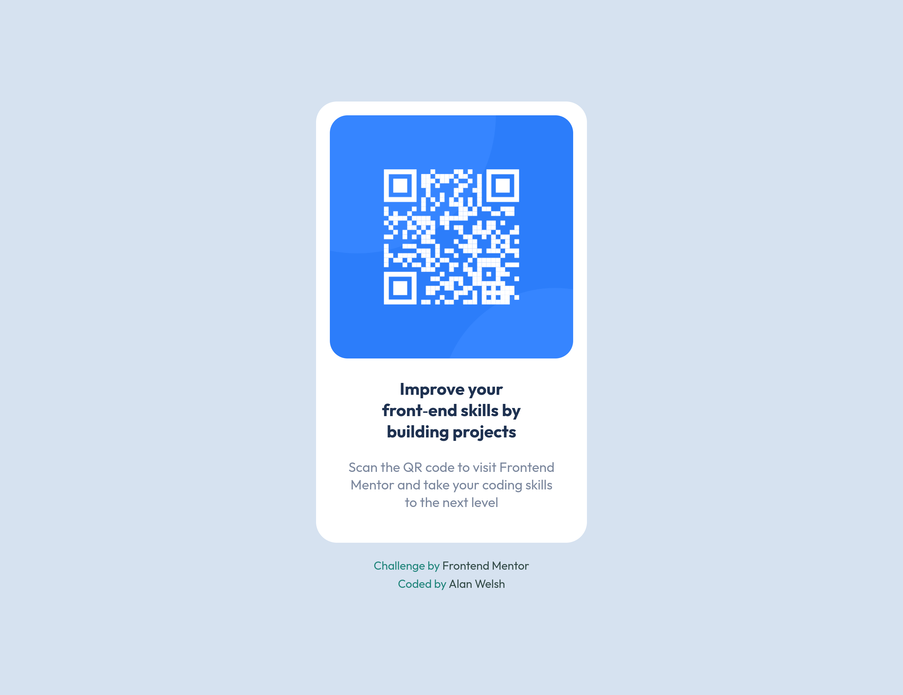

# Frontend Mentor - QR code component solution

This is a solution to the [QR code component challenge on Frontend Mentor](https://www.frontendmentor.io/challenges/qr-code-component-iux_sIO_H). Frontend Mentor challenges help you improve your coding skills by building realistic projects. 

## Table of contents

- [Overview](#overview)
  - [Screenshot](#screenshot)
  - [Links](#links)
- [My process](#my-process)
  - [Built with](#built-with)
  - [Useful resources](#useful-resources)
- [Author](#author)

## Overview

### Screenshot

### Links

- Solution URL: [GitHub](https://github.com/Pound-Hash/qr-code.git)
- Live Site URL: [Vercel](https://qr-code-beta-wheat.vercel.app)

## My process

### Built with

- Semantic HTML5 markup
- CSS Grid
- Mobile-first workflow

### Useful resources

- [W3Schools](https://www.w3schools.com) - HTML & CSS reference documentation
- [CSS-Tricks](https://css-tricks.com) - CSS guides and reference documentation
- [Stack Overflow](https://stackoverflow.com) - Q&A platform

## Author

- Frontend Mentor - [@Pound-Hash](https://www.frontendmentor.io/profile/Pound-Hash)

